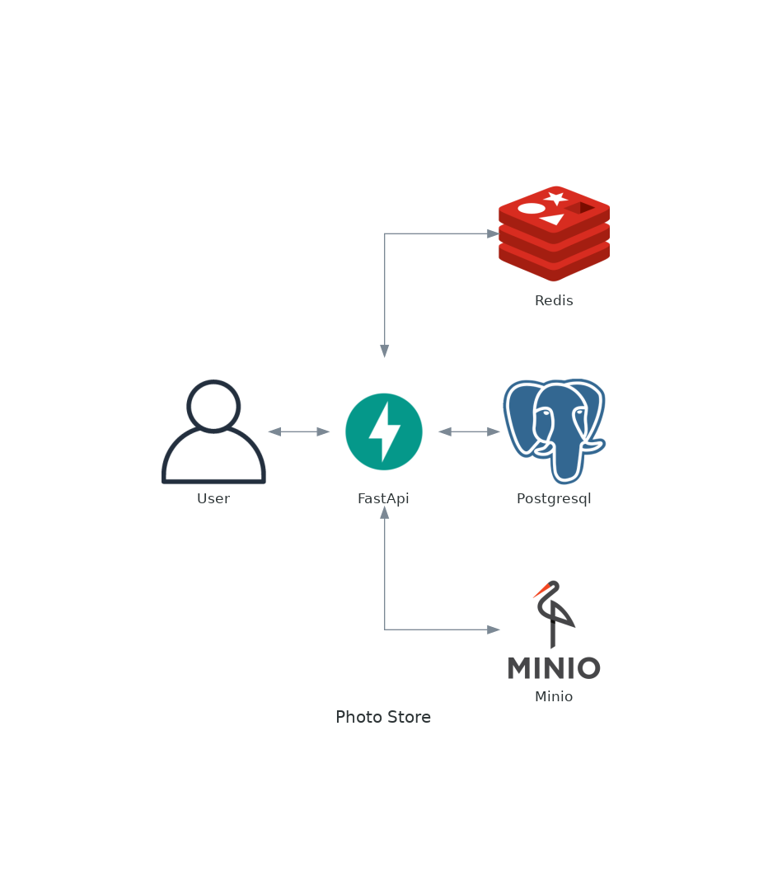

# Leafroot
Leafroot is a personal exercise for me as a software engineer and data engineer.

## Features

    1. Everything is asynchronous. Since pretty much all web applications are at their core I/O bound, this project makes
    it easier for new developers to read, understand and write
    asynchronous code. And by "everything" I mean everything:
        - asynchronous controllers
        - asynchronous connections to external services like databases.
        - asynchronous and parallel tests
    2. DONE Alembic made migrations for the database.
    3. DONE: Docker containers and local environment already set up.
    4. DONE: Circle CI config for testing implemented.
    5. TODO: Add chat integration using socketio.
    6. TODO: Implement stress test.
    7. DONE: Mongo database for test.
    8. TODO: Implement Exception processing.
    9. TODO: Implement Super User.
    10. TODO: Add a rate limiter and used circumvent it in testing.
    11. TODO: Implement a key-value store.
    12. TODO: Implement a unique id generator in distributed systems.
    23. DONE: Implement a url shortner.
    24. TODO: Implement a web crawler.
    25. TODO: Implement a notification system.
    26. TODO: Implement a news feed system.
    27. TODO: Implement a chat system.
    28. TODO: Implement a search autocomplete system.
    29. TODO: Implement Youtube.
    30. TODO: Implement Google Drive.
    31. TODO: Implement coverage html page exposed from path.
    32. DONE: Implement OpenAPI Swagger documentation and write
    Postman documentation for frontend developers.
    34. TODO: Implement discord.
    35. TODO: Implement stress test with locust and docker.
    36. TODO: Add ChatGPT features.
    37. TODO: Add slack integrations.
    38. TODO: Add DISCORD implementation.
    39. TODO: Implement pagination, async logging, payload compression.
    40. TODO: Organize ELK infrastructure for logging.
    41. TODO: Create an ETL for machine learning models training and releasing to production.
    42. DONE: Create a photo store.


## Project environment set up (for vscode and docker users)


    1. Clone this repo in a directory..
    2. Open it in vscode.
    3. Install Dev-Containers extension.
    4. Export the variabile ENV_FILE to the newly created .env_user file.
    5. Run "make start_full_services"
    6. Attack to the "backend" service using the vscode extension.


## Programming norms

   1.Please add docstring on each new file, class, and functions to stipulate their purpose and functionality.
   An example for one is down below:

        ```
        def add_binary(a, b):
            '''
            Returns the sum of two decimal numbers in binary digits.

                    Parameters:
                            a (int): A decimal integer
                            b (int): Another decimal integer

                    Returns:
                            binary_sum (str): Binary string of the sum of a and b
            '''
            binary_sum = bin(a+b)[2:]
            return binary_sum


        print(add_binary.__doc__)
        ```
    2. To check correctitude of the code format use "make lint" to get a score for your style on the project, Always push for a 10!
    3. Use the following commands for some help:
       1. "make format" - formats your code using the "black" functionality
       2. "make typehint" - check for mis typing variables
    4. Use the command "make coverage" or "make coverage_parallel" to
    verify what percentage of your code is checked, Push for 100%!

# Create migration and apply them:

alembic revision --autogenerate -m "<migration_message>"
alembic upgrade head

# For updating the current install packages in poetry use the following

```
poetry update # this updates packages in lock file
poetry self add poetry-plugin-up
poetry up # this updates package versions in pyproject.toml
```

# To run pre-commit hooks without commit
```
pre-commit run --all-files
```


What to learn in this project
- Adhering to programming standards
- Programming design principles, such as:
  - Single Responsibility Principle
  - Open/Closed Principle
  - Liskov Substitution Principle
  - Interface Segregation Principle
  - Dependency Inversion Principle
- Design patterns, including:
  - Creational patterns
  - Structural patterns
  - Behavioral patterns
- Enhancing code readability through effective naming
- Testing concepts, like:
  - End-to-end (E2E) testing
  - Unit testing
- Managing time efficiently
- Strategically pacing project development


